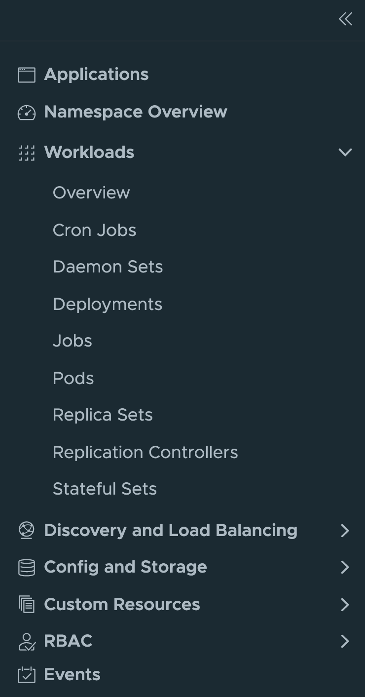
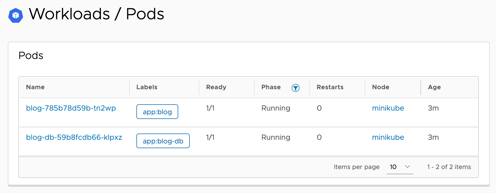

The overview page for a namespace will show all namespaced resources for a namespace. This can be a lot of information.

If you are only interested in specific resource types, you can instead click on the resource type in the left hand side menu.

Click on the **Overview->Workloads->Pods** category. This will bring up a list of just the pods running in the namespace.

You can then select a specific pod to see the details page for it.
