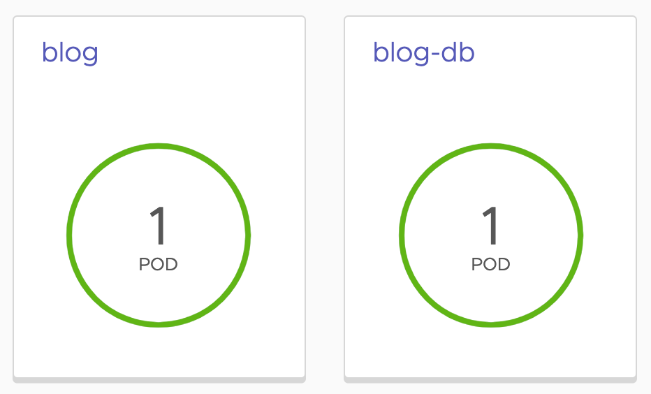

To help you visualize the workloads and the relationship between them and related resources, Octant provides an alternate view than the overview for viewing workloads.

To access this, click on **Workloads** at the top of the left hand side menu (not the **Workloads** section under **Overview**). This will display a set of cards representing each of the workloads deployed in the namespace.

In this case we have two, corresponding to the deployments for the blog application and the database. If you scaled down the number of replicas for the blog application, you will see 1 pod, otherwise you will see the original of 2.

Click on ``blog`` in the card for that deployment. This will bring up a further visualization showing a representation of the connections between the resources making up the overall application deployment.

The color of the rectangles for each resource can change based on their state.

Click on a rectangle for a resource and will display a popup to the right giving a summary of the state of the resource.

You can also access a similar visualization by clicking on the **Resource Viewer** tab when looking at the details for a specific resource selected from the overview page or list of resources under a resource category.
