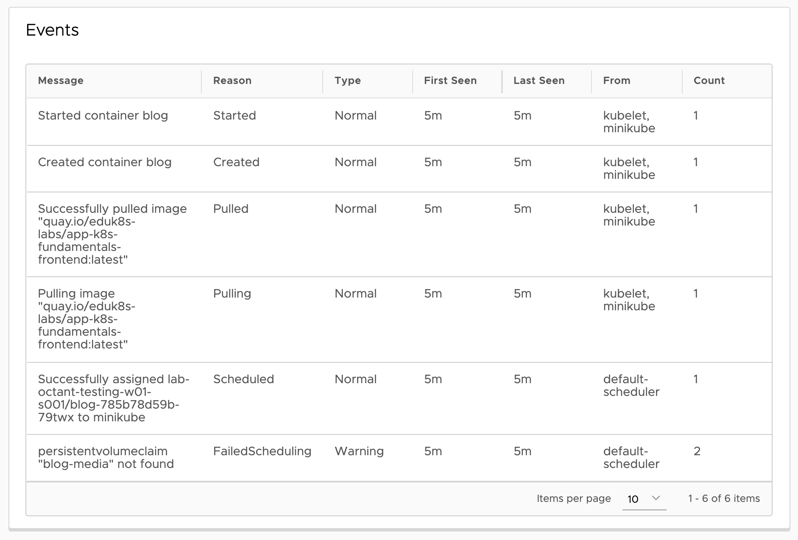

Logs capture messages output by your application. They do not capture information related to the management of workloads (deployments, replica sets, pods etc.), which are generated from the Kubernetes control plane. Such information is output as event resource objects.

To view the events generated for the pod, scroll down to the bottom of the pod details page.

A similar events section will appear under any resource type corresponding to a workload.

You can see all events generated within a namespace by selecting **Overview->Events** in the left hand side menu.
