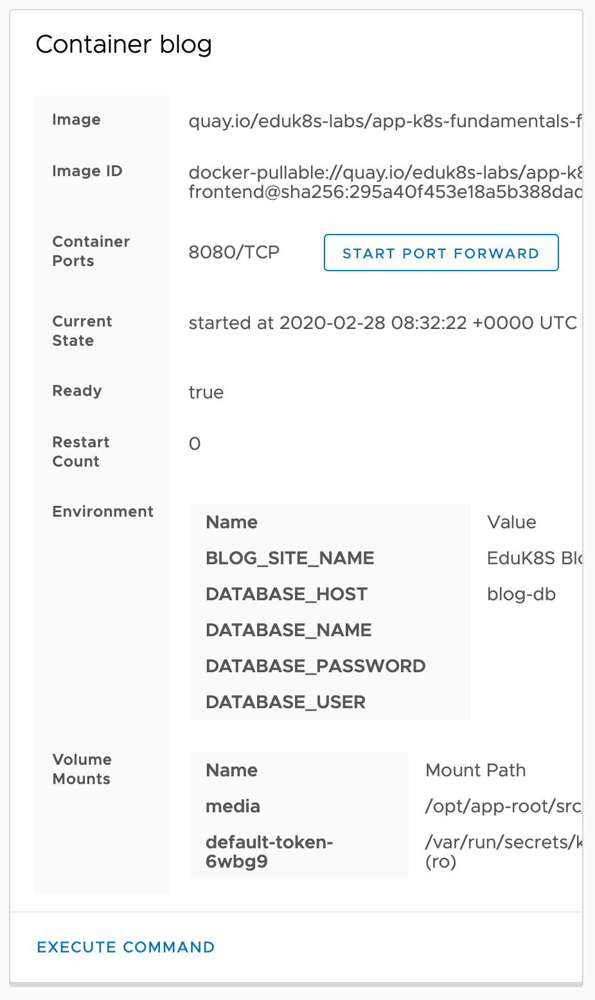
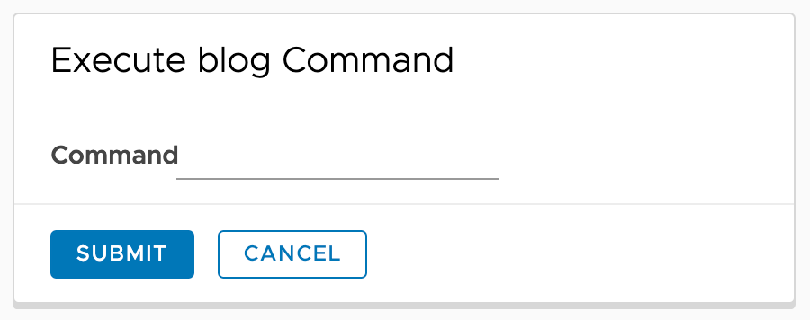
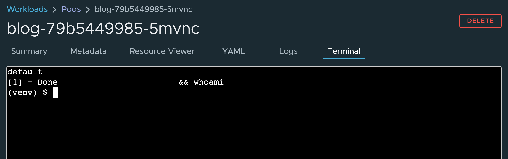

If you need to access a container and interact with the processes running in it, the same as if running ``kubectl exec`` from the command line, scroll to the **Container** card on the pod details page.



Click on ``EXECUTE COMMAND`` at the bottom.

This will result in the card being replaced with a new card titled **Execute Command**.

<span class="fas fa-bug"></span> Note that due to an issue with Octant as described in [issue #738](https://github.com/vmware-tanzu/octant/issues/738) of the Octant project issue tracker, the replacement card may be placed off the top of the viewable area of the browser. Scroll back up the page if necessary.



You can enter any command that is able to be executed within the context of the container.

For the command enter:

```copy
bash
```

and click on ``SUBMIT``.

This will result in the display of a terminal pane at the bottom of the page and terminal shell prompt will be shown.



You can now interact with any processes running inside of the container. When finished click on the "**X**" at the top of the terminal window to dismiss it.
