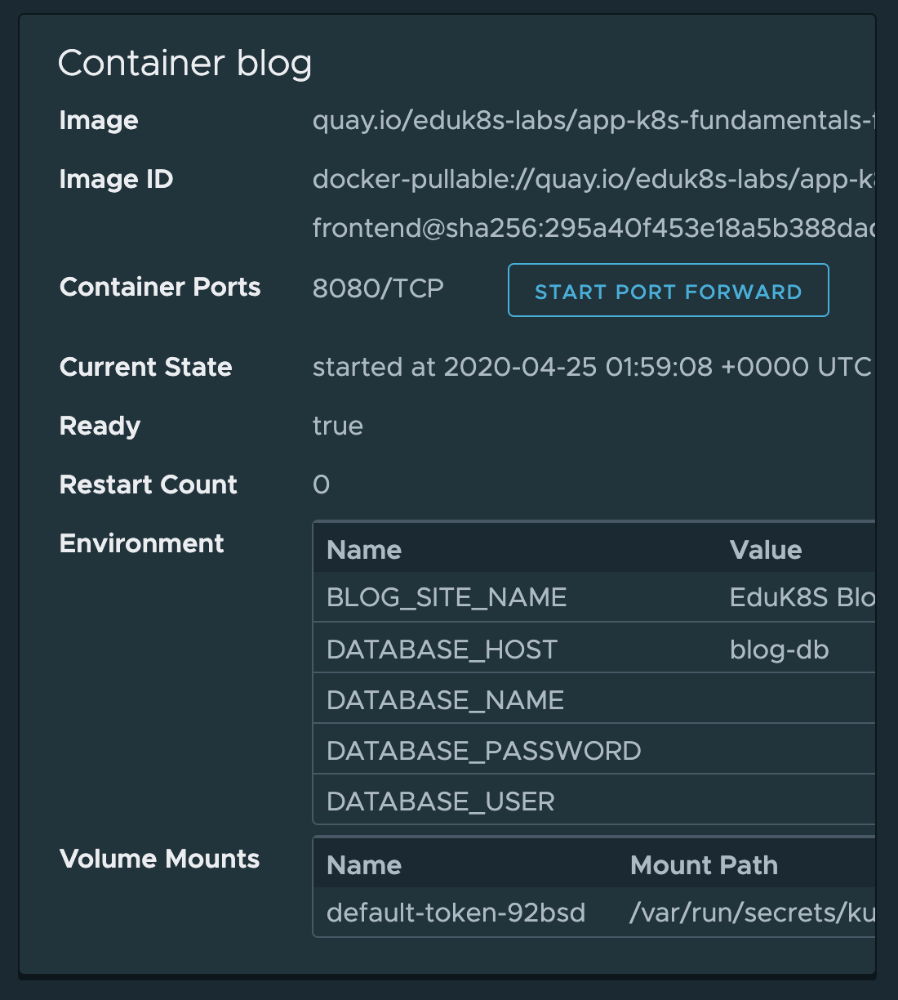
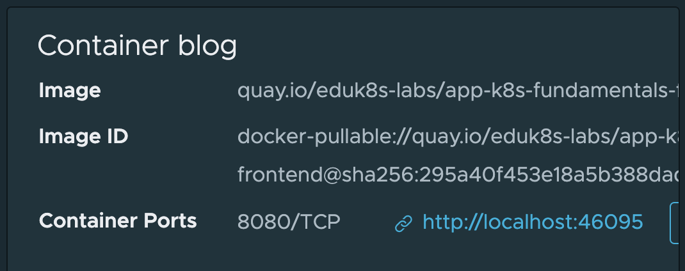

In the case of the blog application being used, an ingress was created allowing it to be accessed from outside of the cluster. If an application was not exposed using an ingress, yet you needed to access it from your local client machine, you can use port forwarding.

If using port forwarding from the command line you would use the ``kubectl port-forward`` command. From Octant, you can set up port forwarding for a container by clicking on **START PORT FORWARD** on the container card on the pod details page.



Once the port forwarding has been setup, the URL to access the exposed port of the pod will be displayed.



Note that this URL will only work when accessed from a web browser or HTTP client running on the same host as Octant. In this workshop environment, because Octant is being run inside of a container inside of the Kubernetes cluster, it will only be accessible from the terminal provided by the workshop environment. If you wish to try, switch to the terminal in the workshop dashboard and run:

```copy-and-edit
curl http://localhost:12345
```

Replace the port number ``12345`` in this command with the actual port number displayed by Octant.

If you set up port forwarding and forget what is running, you can click on **Port Forwards** in the left hand side menu. This will bring up a page displaying a list of all active port forwarding sessions.
