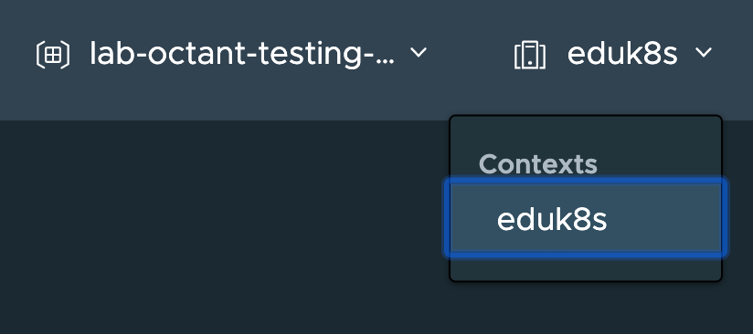

Octant is designed to be run from your local client machine. It will read the same Kubernetes client configuration as is generated by ``kubectl``. It will connect using the current configuration context.

To view the current configuration context, you can run:

```execute
kubectl config current-context
```

You can view more details about the current context by running:

```execute
kubectl config get-contexts `kubectl config current-context`
```

If you have more than one context, you can view details on all of them by running:

```execute
kubectl config get-contexts
```

In this workshop environment there is only one context defined, so Octant doesn't provide the option to switch contexts.

If you do have multiple contexts configured, you can change the current context by selecting the context drop down menu top right in the Octant dashboard. Changing the context from Octant will only affect the Octant dashboard and will not affect what you do from the command line.



Because different contexts can be linked to different users, or even different clusters, this makes it easy to use Octant with any Kubernetes cluster you have access to.
