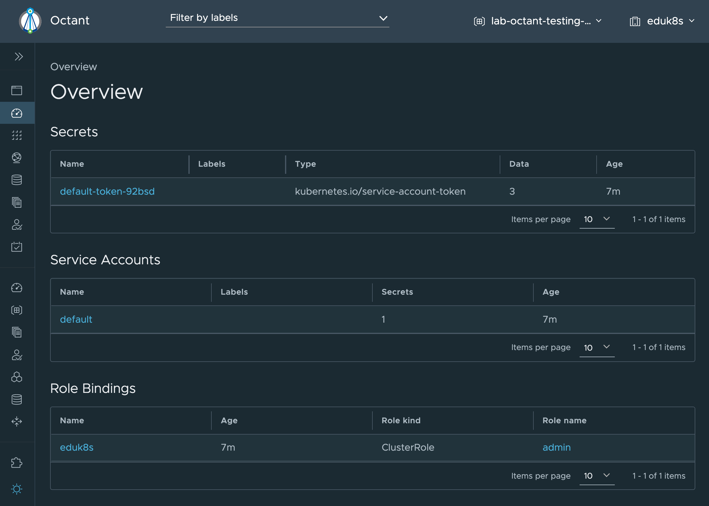

Octant is an open source developer-centric web interface for Kubernetes that lets you inspect a Kubernetes cluster and its applications.

It provides an alternative to the de-facto Kubernetes dashboard that is typically available with a Kubernetes cluster. Whereas the Kubernetes dashboard would be hosted in the cluster, Octant is deployed to your own local desktop machine. Octant works with your local Kubernetes client configuration, meaning you can use it with whatever Kubernetes cluster you are working with. You can easily switch contexts, allowing you to operate against a cluster with a different identity, or even change clusters.

Is this workshop you will get a quick introduction to Octant, how to navigate its interface to access details of your Kubernetes cluster and the applications you have deployed, as well as how to switch contexts between different users and clusters.
